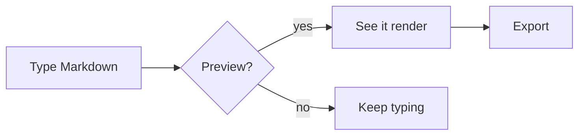

# Markdown syntax — the parts EIDON renders

This is a working cheat sheet. Switch to **Preview** (`Ctrl+Shift+P` until you land on Preview) to see each block render.

## Headings

```
# H1   ## H2   ### H3   #### H4
```

# Heading 1
## Heading 2
### Heading 3

## Inline

**bold**, *italic*, ~~strikethrough~~, ==marked==, `inline code`, [link](https://github.com/NAMEWTA/eidon), and footnotes[^1].

[^1]: Footnotes are auto-numbered.

## Lists

- Unordered
  - Nested
- More items

1. Ordered
2. Items
   1. Nested

- [ ] Task list
- [x] Completed

## Block quote

> "Markdown is plain text with rules."
> — anyone who has used a CMS

## Code

```ts
function greet(name: string): string {
  return `Hello, ${name}!`;
}
```

## Tables

| Feature | Edit | Preview |
| ------- | :--: | :-----: |
| Word wrap | ✓ | — |
| Outline | ✓ | ✓ |
| Mermaid | — | ✓ |

## Math (KaTeX)

Inline: $E = mc^2$.

Display:

$$
\int_0^\infty e^{-x^2}\, dx = \frac{\sqrt{\pi}}{2}
$$

## Diagrams (Mermaid)



## Front matter

```yaml
---
title: My document
imageRoot: ./images
---
```

`imageRoot` is an EIDON extension — pasted/dropped images are saved to that folder relative to the file.

## Horizontal rule

A `---` on its own line between paragraphs draws a horizontal rule. At the very top of a file, `---` instead opens a YAML **front-matter** block (metadata like `title`, `tags`, `created`).
